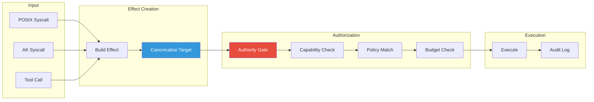
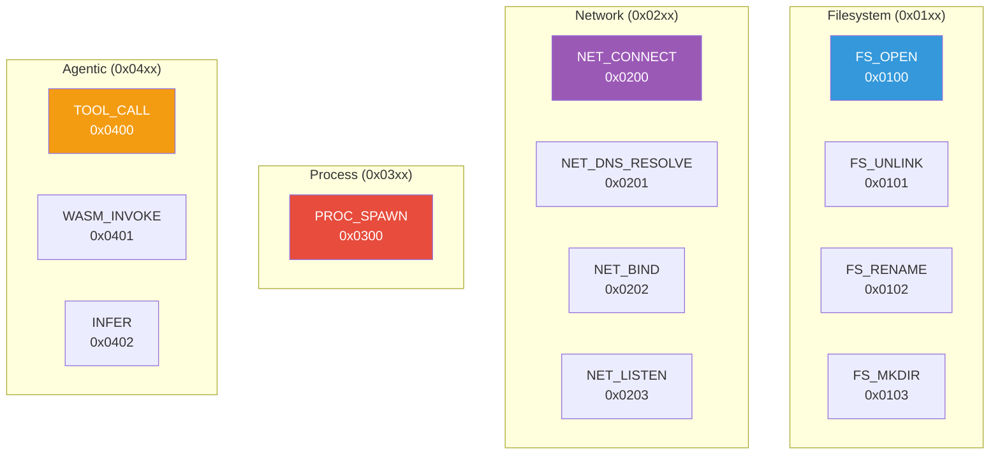
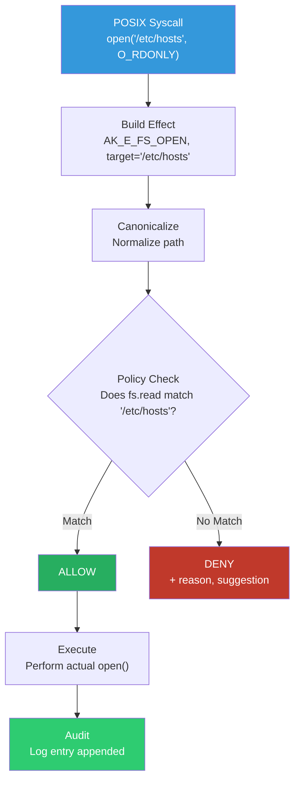
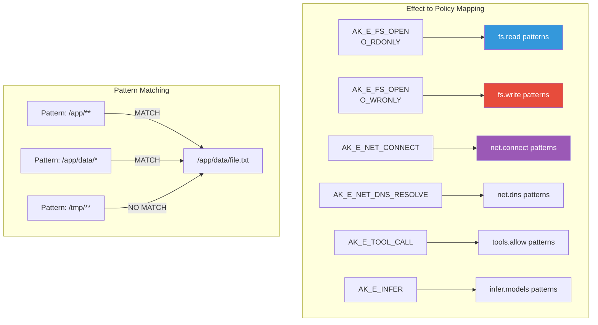

# Effects Reference

Effects are the fundamental unit of authorization in the Authority Kernel.

## Effect Processing Pipeline



## What is an Effect?

An **effect** is any operation that:
- Accesses external resources (files, network)
- Modifies state (heap, audit log)
- Consumes resources (tokens, API calls)

POSIX syscalls are translated into effects before policy evaluation.

## Effect Types



### Filesystem Effects (0x01xx)

| Effect | Code | Description |
|--------|------|-------------|
| `AK_E_FS_OPEN` | 0x0100 | Open file for read/write |
| `AK_E_FS_UNLINK` | 0x0101 | Delete file |
| `AK_E_FS_RENAME` | 0x0102 | Rename/move file |
| `AK_E_FS_MKDIR` | 0x0103 | Create directory |

### Network Effects (0x02xx)

| Effect | Code | Description |
|--------|------|-------------|
| `AK_E_NET_CONNECT` | 0x0200 | Establish connection |
| `AK_E_NET_DNS_RESOLVE` | 0x0201 | DNS lookup |
| `AK_E_NET_BIND` | 0x0202 | Bind to port |
| `AK_E_NET_LISTEN` | 0x0203 | Listen for connections |

### Process Effects (0x03xx)

| Effect | Code | Description |
|--------|------|-------------|
| `AK_E_PROC_SPAWN` | 0x0300 | Create child agent |

### Agentic Effects (0x04xx)

| Effect | Code | Description |
|--------|------|-------------|
| `AK_E_TOOL_CALL` | 0x0400 | Execute tool |
| `AK_E_WASM_INVOKE` | 0x0401 | Run WASM module |
| `AK_E_INFER` | 0x0402 | LLM inference |

## Effect Request Structure

```c
typedef struct ak_effect_req {
    ak_effect_op_t op;
    u64 trace_id;
    pid_t pid;
    tid_t tid;

    /* Canonical target string:
     * - FS: absolute normalized path
     * - NET_CONNECT: "ip:1.2.3.4:443" OR "dns:example.com:443"
     * - NET_DNS_RESOLVE: "dns:example.com"
     * - TOOL: "tool:<name>:<version>"
     * - INFER: "model:<name>:<version>"
     */
    char target[512];

    /* Compact encoded params (JSON) */
    u8 params[4096];
    u32 params_len;

    /* Budgets/limits */
    struct {
        u64 cpu_ns;
        u64 wall_ns;
        u64 bytes;
        u64 tokens;
    } budget;
} ak_effect_req_t;
```

## Authorization Decision

```c
typedef struct ak_decision {
    boolean allow;
    int reason_code;
    int errno_equiv;
    char missing_cap[64];
    char suggested_snippet[512];
    u64 trace_id;
    char detail[256];
} ak_decision_t;
```

## Denial Reasons

| Code | Name | Description |
|------|------|-------------|
| 1 | `AK_DENY_NO_POLICY` | No policy loaded |
| 2 | `AK_DENY_NO_CAP` | Capability required but missing |
| 3 | `AK_DENY_CAP_EXPIRED` | Capability TTL exceeded |
| 4 | `AK_DENY_PATTERN_MISMATCH` | Target doesn't match policy pattern |
| 5 | `AK_DENY_BUDGET_EXCEEDED` | Would exceed resource budget |
| 6 | `AK_DENY_RATE_LIMITED` | Rate limit exceeded |
| 7 | `AK_DENY_TAINT` | Taint level too high for sink |

## Canonicalization

```mermaid
flowchart TB
    subgraph "Filesystem Canonicalization"
        FS_IN["./foo/../bar/file.txt"]
        FS_CWD[CWD: /app]
        FS_ABS[Absolute: /app/./foo/../bar/file.txt]
        FS_CLEAN[Clean: /app/bar/file.txt]
        FS_OUT["/app/bar/file.txt"]

        FS_IN --> FS_CWD
        FS_CWD --> FS_ABS
        FS_ABS --> FS_CLEAN
        FS_CLEAN --> FS_OUT
    end

    subgraph "Network Canonicalization"
        NET_IN["::ffff:192.168.1.1:443"]
        NET_MAP[IPv4-mapped detection]
        NET_NORM[Normalize to IPv4]
        NET_OUT["ip:192.168.1.1:443"]

        NET_IN --> NET_MAP
        NET_MAP --> NET_NORM
        NET_NORM --> NET_OUT
    end

    subgraph "DNS Canonicalization"
        DNS_IN[example.com]
        DNS_FMT[Add prefix]
        DNS_OUT["dns:example.com"]

        DNS_IN --> DNS_FMT
        DNS_FMT --> DNS_OUT
    end

    style FS_OUT fill:#3498db,color:#fff
    style NET_OUT fill:#9b59b6,color:#fff
    style DNS_OUT fill:#2ecc71,color:#fff
```



All targets are canonicalized before policy matching:

### Filesystem Paths

1. Convert relative to absolute (using cwd)
2. Remove `.` segments
3. Resolve `..` segments
4. No trailing slashes (except root)

**Example:**
- Input: `./foo/../bar/file.txt`
- CWD: `/app`
- Output: `/app/bar/file.txt`

### Network Addresses

1. IPv4-mapped IPv6 normalized to IPv4
2. Port always included
3. Format: `ip:<addr>:<port>` or `dns:<host>:<port>`

**Examples:**
- `::ffff:192.168.1.1:443` → `ip:192.168.1.1:443`
- `example.com:8080` → `dns:example.com:8080`

### DNS Targets

Format: `dns:<hostname>`

**Example:**
- `example.com` → `dns:example.com`

## Effect Flow



## Building Effects from Syscalls

```c
/* Helper functions */
int ak_effect_from_open(ak_effect_req_t *req, const char *path, int flags);
int ak_effect_from_connect(ak_effect_req_t *req, const struct sockaddr *addr, socklen_t len);
int ak_effect_from_unlink(ak_effect_req_t *req, const char *path);
```

## Policy Matching



Effects are matched against policy rules:

```json
{
  "fs": {
    "read": ["/etc/**"],  // Matches AK_E_FS_OPEN with O_RDONLY
    "write": ["/tmp/**"]  // Matches AK_E_FS_OPEN with O_WRONLY
  }
}
```

Pattern matching uses glob-style syntax:
- `*` matches any characters except `/`
- `**` matches any characters including `/`
- Exact strings require exact match
