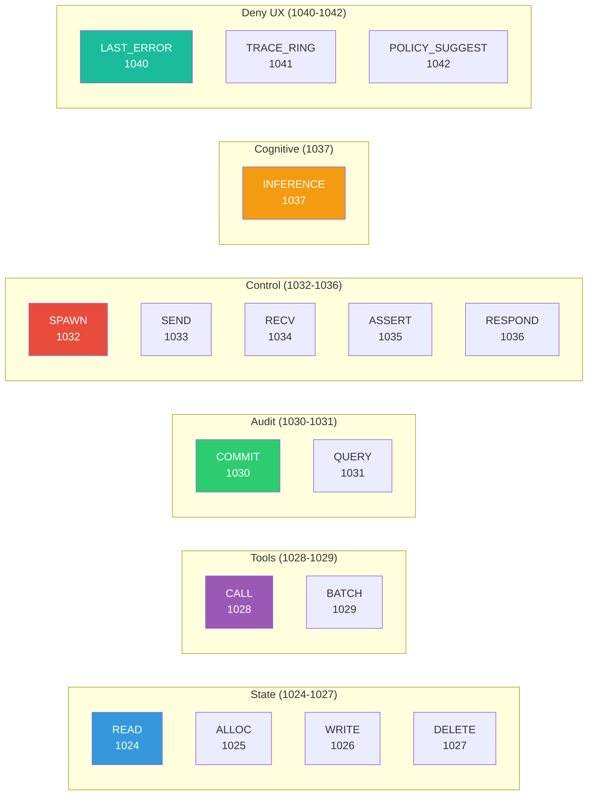
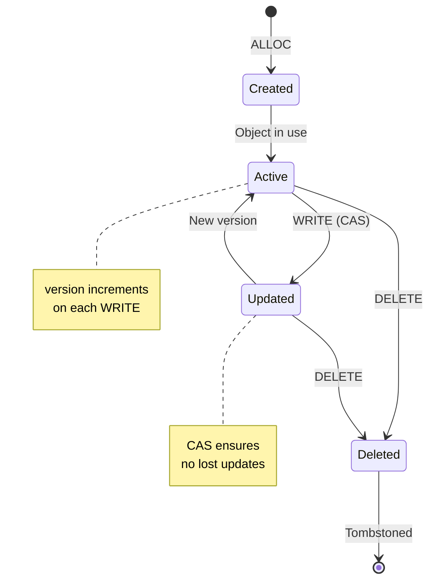
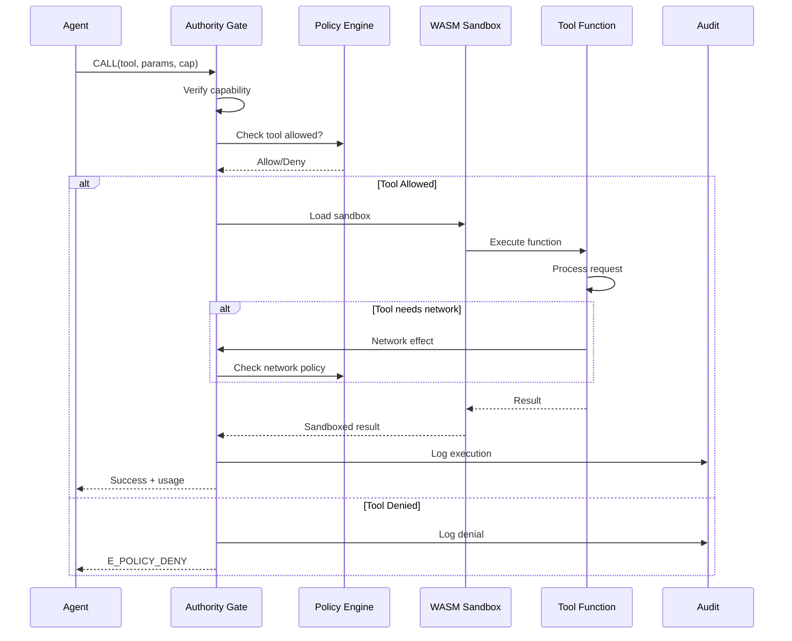
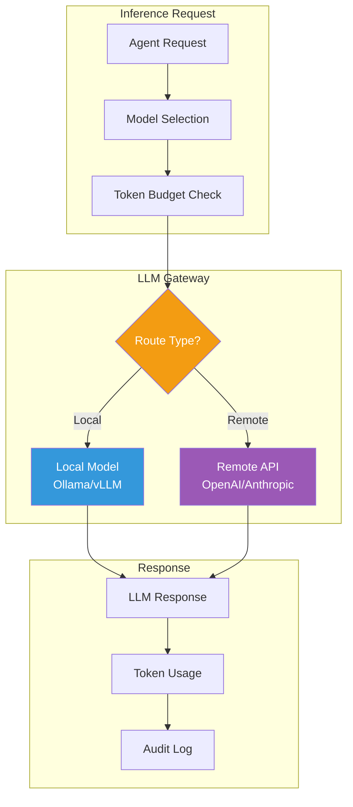
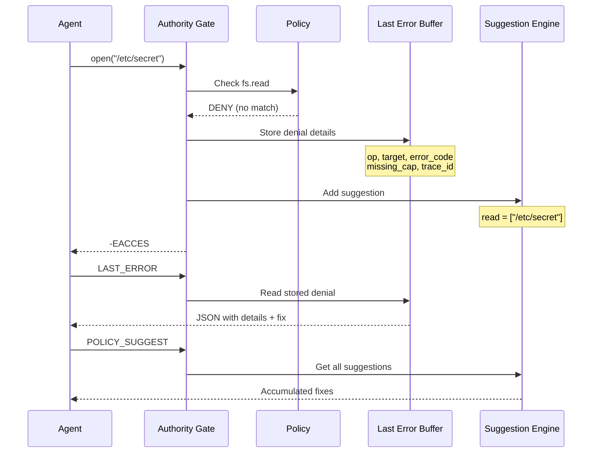

# Syscalls Reference

Detailed documentation for Authority Kernel syscalls.

## Syscall Categories Overview



## State Management



### AK_SYS_READ (1024)

Read a heap object by pointer.

**Request:**
```json
{
  "op": "READ",
  "args": {
    "ptr": 12345
  }
}
```

**Response:**
```json
{
  "ok": true,
  "result": {
    "ptr": 12345,
    "type": "AgentState",
    "version": 5,
    "value": { ... },
    "taint": 0
  }
}
```

**Errors:**
- `ENOENT` - Object not found
- `E_CAP_SCOPE` - Capability doesn't cover this object

### AK_SYS_ALLOC (1025)

Allocate a new heap object.

**Request:**
```json
{
  "op": "ALLOC",
  "args": {
    "type": "AgentState",
    "value": {
      "name": "my-agent",
      "status": "running"
    }
  }
}
```

**Response:**
```json
{
  "ok": true,
  "result": {
    "ptr": 12346,
    "version": 1
  }
}
```

**Errors:**
- `E_SCHEMA_INVALID` - Value doesn't match type schema
- `E_BUDGET_EXCEEDED` - Heap object limit reached

### AK_SYS_WRITE (1026)

Update an existing object with CAS semantics.

**Request:**
```json
{
  "op": "WRITE",
  "args": {
    "ptr": 12345,
    "expected_version": 5,
    "patch": [
      { "op": "replace", "path": "/status", "value": "completed" }
    ]
  }
}
```

**Response:**
```json
{
  "ok": true,
  "result": {
    "version": 6
  }
}
```

**Errors:**
- `E_CONFLICT` - Version mismatch (retry required)
- `E_SCHEMA_INVALID` - Patched value invalid
- `ENOENT` - Object not found

### AK_SYS_DELETE (1027)

Soft-delete an object (sets tombstone flag).

**Request:**
```json
{
  "op": "DELETE",
  "args": {
    "ptr": 12345,
    "expected_version": 6
  }
}
```

**Response:**
```json
{
  "ok": true,
  "result": {
    "deleted": true
  }
}
```

## Tools



### AK_SYS_CALL (1028)

Execute a tool in the WASM sandbox.

**Request:**
```json
{
  "op": "CALL",
  "args": {
    "tool": "http_get",
    "params": {
      "url": "https://api.github.com/users/nanovms"
    }
  },
  "cap": { ... }
}
```

**Response:**
```json
{
  "ok": true,
  "result": {
    "status": 200,
    "body": { ... }
  },
  "usage": {
    "cpu_ns": 1500000,
    "network_bytes": 4096
  }
}
```

**Errors:**
- `E_POLICY_DENY` - Tool not allowed by policy
- `E_CAP_SCOPE` - Capability doesn't cover this tool
- `E_TOOL_FAIL` - Tool execution failed
- `E_BUDGET_EXCEEDED` - Tool call budget exhausted

### AK_SYS_BATCH (1029)

Execute multiple operations atomically.

**Request:**
```json
{
  "op": "BATCH",
  "args": {
    "operations": [
      { "op": "WRITE", "ptr": 100, "version": 5, "patch": [...] },
      { "op": "WRITE", "ptr": 101, "version": 3, "patch": [...] }
    ]
  }
}
```

**Response:**
```json
{
  "ok": true,
  "result": {
    "results": [
      { "version": 6 },
      { "version": 4 }
    ]
  }
}
```

**Errors:**
- `E_CONFLICT` - Any operation version mismatch (all rolled back)

## Audit

### AK_SYS_COMMIT (1030)

Force immediate log commit (fsync).

**Request:**
```json
{
  "op": "COMMIT"
}
```

**Response:**
```json
{
  "ok": true,
  "result": {
    "seq": 1234,
    "hash": "abc123..."
  }
}
```

### AK_SYS_QUERY (1031)

Query the audit log.

**Request:**
```json
{
  "op": "QUERY",
  "args": {
    "run_id": "2024-01-15T10:30:00Z",
    "from_seq": 0,
    "to_seq": 100
  }
}
```

**Response:**
```json
{
  "ok": true,
  "result": {
    "entries": [
      {
        "seq": 1,
        "op": "ALLOC",
        "req_hash": "...",
        "res_hash": "...",
        "this_hash": "..."
      }
    ]
  }
}
```

## Cognitive



### AK_SYS_INFERENCE (1037)

Call the LLM gateway.

**Request:**
```json
{
  "op": "INFERENCE",
  "args": {
    "type": "chat",
    "model": "claude-3-5-sonnet",
    "messages": [
      { "role": "user", "content": "Hello!" }
    ],
    "max_tokens": 1000,
    "temperature": 0.7
  },
  "cap": { ... }
}
```

**Response:**
```json
{
  "ok": true,
  "result": {
    "content": "Hello! How can I help you today?",
    "model": "claude-3-5-sonnet",
    "finish_reason": "stop"
  },
  "usage": {
    "input_tokens": 10,
    "output_tokens": 15,
    "latency_ms": 450
  }
}
```

**Errors:**
- `E_POLICY_DENY` - Model not allowed
- `E_CAP_SCOPE` - Inference capability missing
- `E_BUDGET_EXCEEDED` - Token budget exhausted

## Deny UX



### AK_SYS_LAST_ERROR (1040)

Get details of the last denial.

**Request:**
```json
{
  "op": "LAST_ERROR"
}
```

**Response:**
```json
{
  "ok": true,
  "result": {
    "op": "FS_OPEN",
    "target": "/etc/secret",
    "error_code": -4201,
    "missing_cap": "fs.read",
    "suggested_fix": "read = [\"/etc/secret\"]",
    "trace_id": "0x1234567890"
  }
}
```

### AK_SYS_POLICY_SUGGEST (1042)

Get accumulated policy suggestions (when in RECORD mode).

**Request:**
```json
{
  "op": "POLICY_SUGGEST"
}
```

**Response:**
```json
{
  "ok": true,
  "result": {
    "suggestions": [
      {
        "section": "fs.read",
        "pattern": "/etc/hosts"
      },
      {
        "section": "net.dns",
        "pattern": "api.example.com"
      }
    ]
  }
}
```
