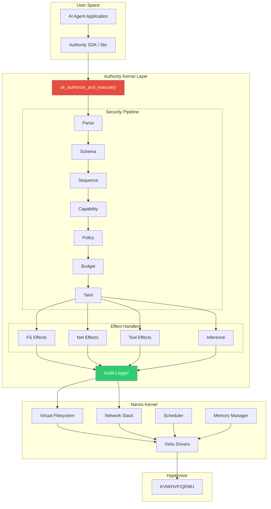
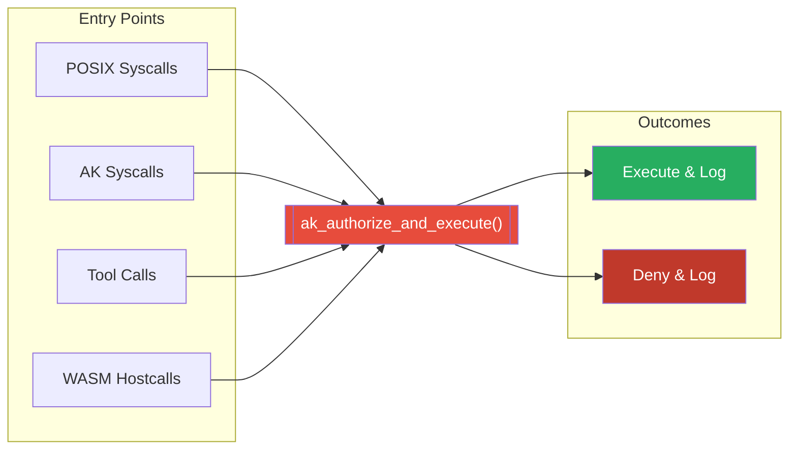
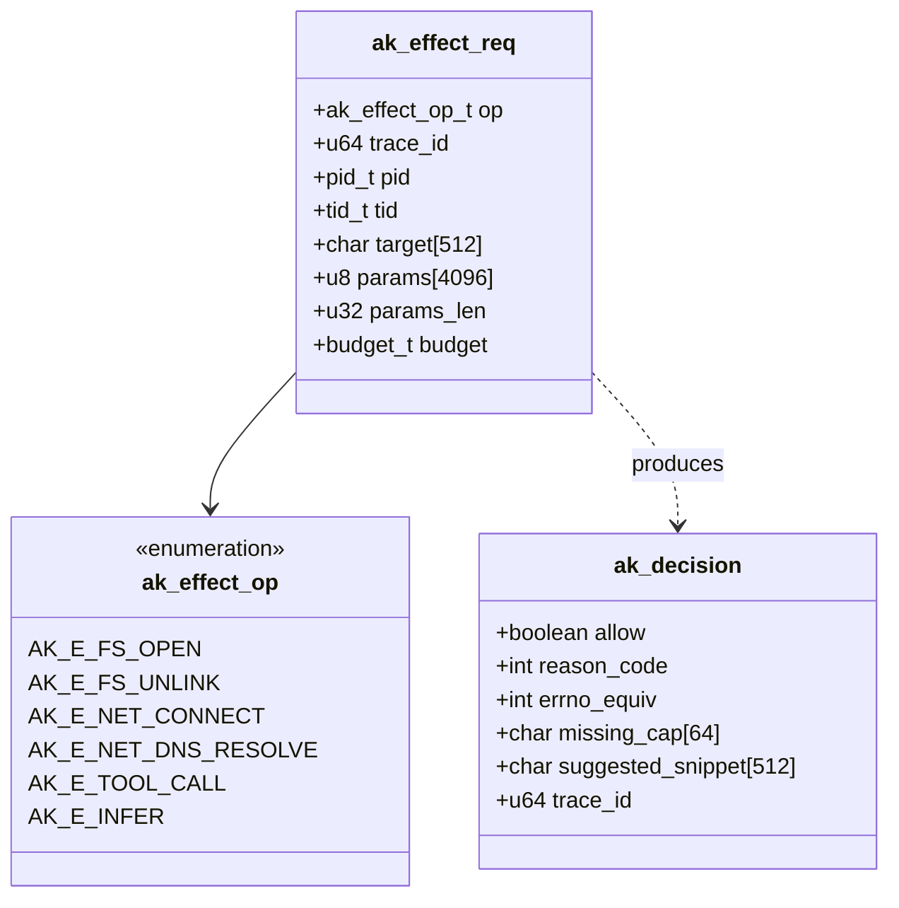
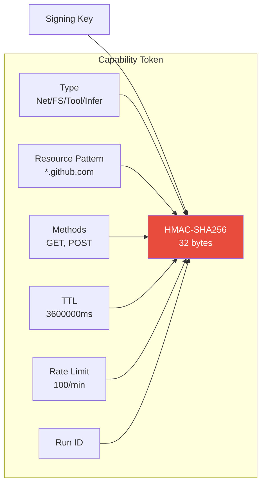
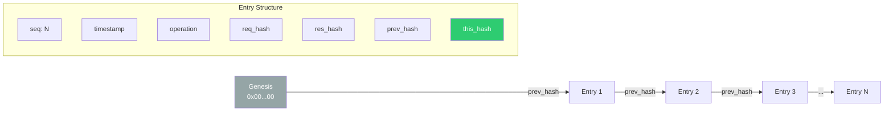
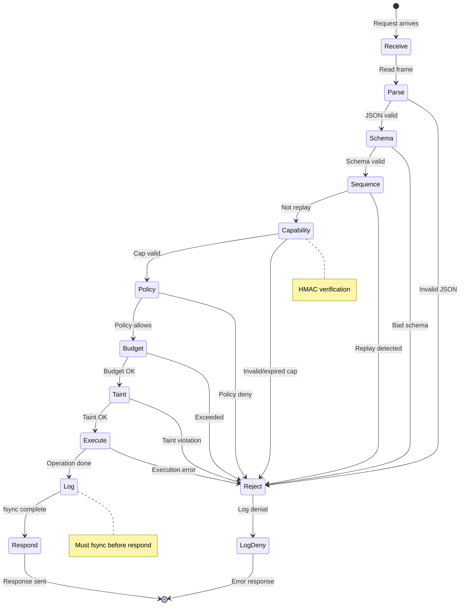
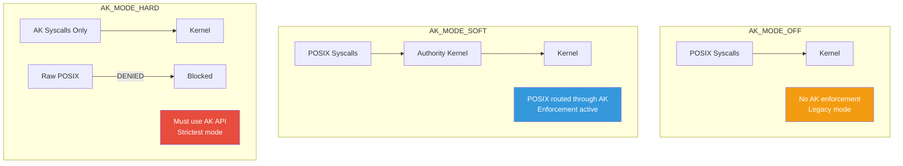
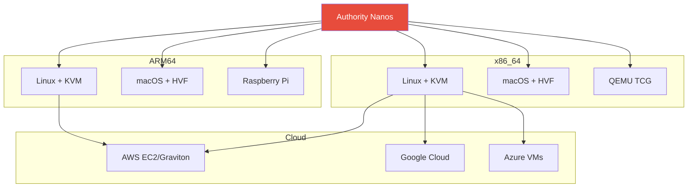
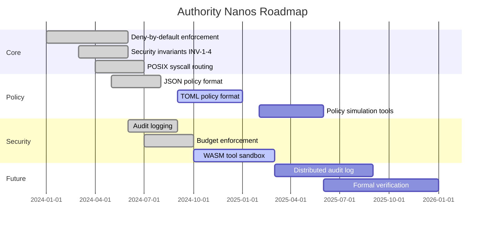

# Architecture Overview

Authority Nanos is a **fork of [Nanos](https://github.com/nanovms/nanos)** that adds the Authority Kernel — a capability-based security layer for AI agents.

## System Stack

## Core Principle: Single Authority Gate

All authority-bearing operations MUST flow through ONE enforcement function:

- POSIX syscalls are a **compatibility frontend** that translate into AK effects
- Default is **DENY-BY-DEFAULT**: if policy cannot prove allow, deny the effect
- Agentic primitives (tools, WASM, inference) are first-class effects

## Effect Model

Every effectful operation is expressed as an **AK Effect**:

## Key Components

### Component Relationships

```mermaid
graph TB
    subgraph "Policy System"
        POLICY_FILE[Policy File<br/>JSON/TOML]
        POLICY_LOADER[Policy Loader]
        POLICY_V2[ak_policy_v2_t]
        PATTERN[Pattern Matcher]
    end

    subgraph "Capability System"
        CAP_TOKEN[Capability Token]
        HMAC[HMAC-SHA256]
        KEYRING[Keyring]
        REVOKE[Revocation Map]
    end

    subgraph "Audit System"
        LOG_ENTRY[Log Entry]
        HASH_CHAIN[Hash Chain]
        RING_BUF[Ring Buffer]
        ANCHOR[External Anchor]
    end

    subgraph "Budget System"
        BUDGET_DEF[Budget Definition]
        USAGE[Usage Tracker]
        ADMIT[Admission Control]
    end

    POLICY_FILE --> POLICY_LOADER
    POLICY_LOADER --> POLICY_V2
    POLICY_V2 --> PATTERN

    CAP_TOKEN --> HMAC
    HMAC --> KEYRING
    CAP_TOKEN --> REVOKE

    LOG_ENTRY --> HASH_CHAIN
    HASH_CHAIN --> RING_BUF
    HASH_CHAIN --> ANCHOR

    BUDGET_DEF --> ADMIT
    USAGE --> ADMIT

    style HMAC fill:#e74c3c,color:#fff
    style HASH_CHAIN fill:#2ecc71,color:#fff
    style ADMIT fill:#9b59b6,color:#fff
```

### Capability Token Structure

### Audit Log Hash Chain

## Request Processing Pipeline

## Modes of Operation

## Platform Support

## Roadmap

