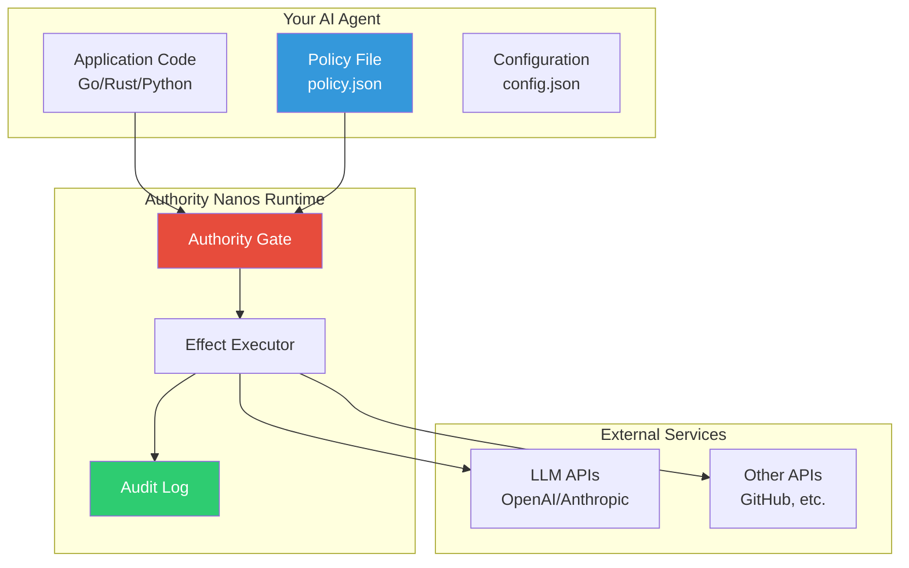
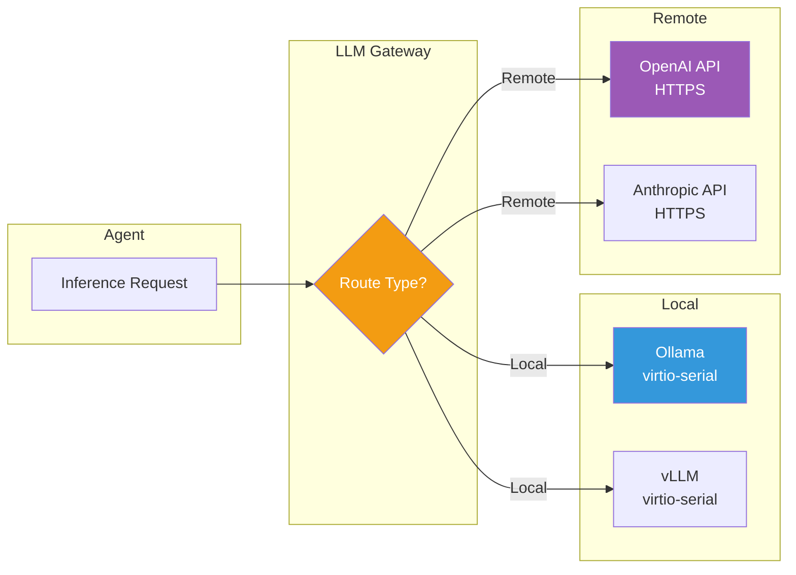
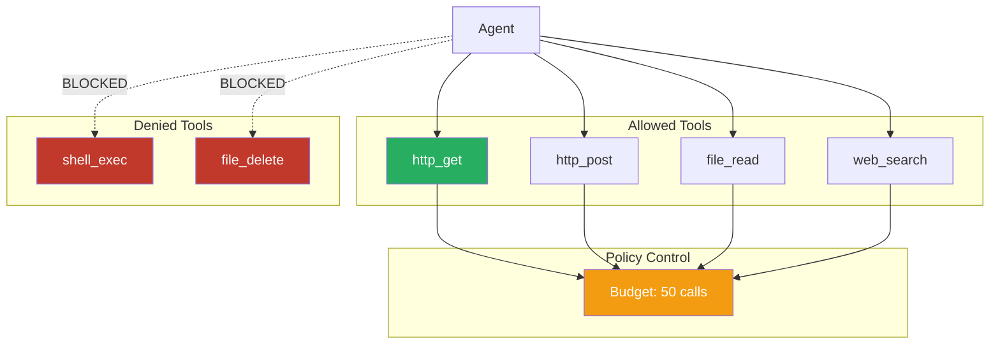

# Building Your First Agent

This guide walks you through creating a simple AI agent that runs on Authority Nanos.

## Agent Architecture



## Overview

An AI agent on Authority Nanos consists of:

1. **Application code** - Your agent logic (Go, Rust, Python, etc.)
2. **Policy file** - Defines what the agent can do
3. **Configuration** - Runtime settings including LLM configuration

## Step 1: Create the Agent Code

Here's a simple agent in Go that makes API calls:

```go
// agent.go
package main

import (
    "fmt"
    "io"
    "net/http"
)

func main() {
    // Make an allowed API call
    resp, err := http.Get("https://api.github.com/users/nanovms")
    if err != nil {
        fmt.Printf("Error: %v\n", err)
        return
    }
    defer resp.Body.Close()

    body, _ := io.ReadAll(resp.Body)
    fmt.Printf("Response: %s\n", body)
}
```

Build it:

```bash
GOOS=linux GOARCH=amd64 go build -o agent agent.go
```

## Step 2: Create the Policy

Create `policy.json`:

```json
{
  "version": "1.0",
  "fs": {
    "read": ["/app/**", "/etc/ssl/**", "/etc/resolv.conf"]
  },
  "net": {
    "dns": ["api.github.com"],
    "connect": ["dns:api.github.com:443"]
  },
  "profiles": ["tier1-musl"]
}
```

This policy:
- Allows reading application files and SSL certificates
- Allows DNS resolution for `api.github.com`
- Allows HTTPS connections to `api.github.com`
- Denies everything else

## Step 3: Create the Configuration

Create `config.json`:

```json
{
  "Files": ["policy.json"],
  "Dirs": ["ak"],
  "Args": [],
  "Env": {},
  "MapDirs": {
    "ak": "ak"
  }
}
```

Set up the directory structure:

```bash
mkdir -p ak
cp policy.json ak/policy.json
```

## Step 4: Run the Agent

```bash
ops run -c config.json agent
```

You should see the GitHub API response. If you try to access a different domain, it will be denied:

```
AK DENY NET_CONNECT dns:evil.com:443 missing net.connect. Fix: connect = ["dns:evil.com:443"]
```

## Adding LLM Support



To add LLM capabilities to your agent:

### Local Model (Ollama)

Start Ollama on the host:

```bash
ollama serve
```

Update your policy:

```json
{
  "version": "1.0",
  "infer": {
    "models": ["llama3.1:*", "codellama:*"],
    "max_tokens": 100000
  },
  "budgets": {
    "tokens": 100000
  }
}
```

### External API (OpenAI/Anthropic)

Update your policy:

```json
{
  "version": "1.0",
  "net": {
    "dns": ["api.openai.com", "api.anthropic.com"],
    "connect": ["dns:api.openai.com:443", "dns:api.anthropic.com:443"]
  },
  "infer": {
    "models": ["gpt-4", "claude-*"],
    "max_tokens": 100000
  },
  "budgets": {
    "tokens": 100000
  }
}
```

## Adding Tool Support



To allow your agent to use tools:

```json
{
  "version": "1.0",
  "tools": {
    "allow": [
      "http_get",
      "http_post",
      "file_read",
      "web_search"
    ],
    "deny": [
      "shell_exec",
      "file_delete"
    ]
  },
  "budgets": {
    "tool_calls": 50
  }
}
```

## Complete Example

Here's a complete policy for a typical AI agent:

```json
{
  "version": "1.0",
  "fs": {
    "read": ["/app/**", "/etc/ssl/**"],
    "write": ["/app/workspace/**", "/tmp/**"]
  },
  "net": {
    "dns": ["api.openai.com", "api.anthropic.com", "api.github.com"],
    "connect": [
      "dns:api.openai.com:443",
      "dns:api.anthropic.com:443",
      "dns:api.github.com:443"
    ]
  },
  "tools": {
    "allow": ["http_get", "file_read", "file_write", "web_search"],
    "deny": ["shell_exec"]
  },
  "infer": {
    "models": ["gpt-4", "claude-*"],
    "max_tokens": 100000
  },
  "budgets": {
    "tool_calls": 100,
    "tokens": 100000,
    "wall_time_ms": 300000
  },
  "profiles": ["tier1-musl"]
}
```

## Next Steps

- [Policy Reference](/policy/) - All policy options
- [Security Invariants](/security/invariants) - Understanding the guarantees
- [API Reference](/api/) - Authority Kernel syscalls
