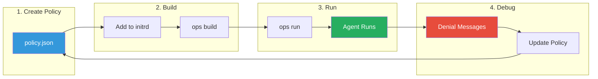
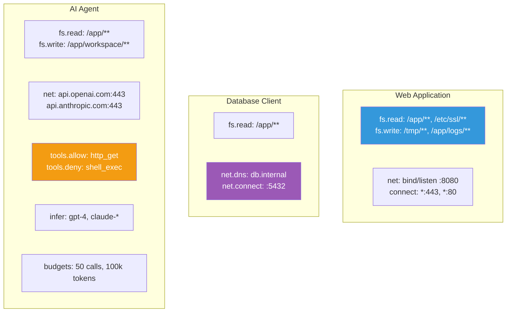

# Quick Start

Get started with the Authority Kernel deny-by-default security model.

## Getting Started Workflow



## Prerequisites

Before you begin, ensure you have:

- [ops](https://ops.city) installed
- A compiled application (Go, Rust, C, etc.)
- Basic familiarity with unikernels

## 1. Create a Policy File

Create `/ak/policy.json` in your initrd:

```json
{
  "version": "1.0",
  "fs": {
    "read": ["/app/**", "/lib/**"],
    "write": ["/tmp/**"]
  },
  "net": {
    "dns": ["api.example.com"],
    "connect": ["dns:api.example.com:443"]
  },
  "profiles": ["tier1-musl"]
}
```

## 2. Build Your Image

```bash
# Include policy in initrd
mkdir -p initrd/ak
cp policy.json initrd/ak/policy.json

# Build with ops
ops build myapp -c config.json
```

## 3. Run

```bash
ops run myapp
```

## 4. Debug Denials

When an operation is denied, you'll see a helpful message:

```
AK DENY FS_OPEN /etc/secret missing fs.read. Fix: read = ["/etc/secret"]
```

### Programmatic Access

```c
// Get last denial info
char buf[1024];
syscall(AK_SYS_LAST_ERROR, buf, sizeof(buf));
// buf contains JSON with details
```

## 5. Common Patterns



### Web Application

```json
{
  "version": "1.0",
  "fs": {
    "read": ["/app/**", "/etc/ssl/**"],
    "write": ["/tmp/**", "/app/logs/**"]
  },
  "net": {
    "dns": ["*"],
    "connect": ["dns:*:443", "dns:*:80"],
    "bind": ["ip:0.0.0.0:8080"],
    "listen": ["ip:0.0.0.0:8080"]
  },
  "profiles": ["tier1-musl"]
}
```

### Database Client

```json
{
  "version": "1.0",
  "fs": {
    "read": ["/app/**"]
  },
  "net": {
    "dns": ["db.internal"],
    "connect": ["dns:db.internal:5432"]
  },
  "profiles": ["tier1-musl"]
}
```

### AI Agent

```json
{
  "version": "1.0",
  "fs": {
    "read": ["/app/**"],
    "write": ["/app/workspace/**"]
  },
  "net": {
    "dns": ["api.openai.com", "api.anthropic.com"],
    "connect": ["dns:api.openai.com:443", "dns:api.anthropic.com:443"]
  },
  "tools": {
    "allow": ["http_get", "file_read"],
    "deny": ["shell_exec"]
  },
  "infer": {
    "models": ["gpt-4", "claude-*"],
    "max_tokens": 100000
  },
  "budgets": {
    "tool_calls": 50,
    "tokens": 100000
  },
  "profiles": ["tier1-musl"]
}
```

## 6. Troubleshooting

### No policy found

```
AK: FATAL - No policy found
AK: Expected policy at: /ak/policy.json (initrd)
```

**Fix:** Ensure `/ak/policy.json` is in your initrd.

### Operation denied

Check the console message and add the suggested rule to your policy.

### Missing capability

The denial message shows exactly which capability is needed:
- `fs.read` - Add path to `fs.read` array
- `fs.write` - Add path to `fs.write` array
- `net.dns` - Add domain to `net.dns` array
- `net.connect` - Add target to `net.connect` array

## Next Steps

- [Installation Guide](/getting-started/installation) - Detailed setup instructions
- [First Agent](/getting-started/first-agent) - Build your first AI agent
- [Policy Reference](/policy/) - Complete policy documentation
- [Security Model](/security/) - Understand the threat model
