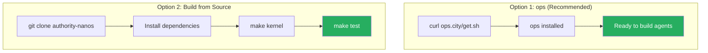
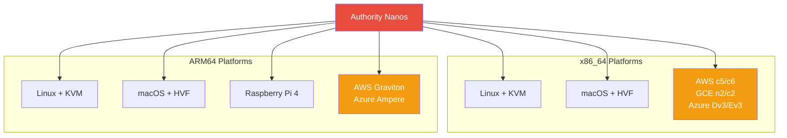

# Installation

## Installation Methods



## Using ops (Recommended)

The fastest way to get started with Authority Nanos is using [ops](https://ops.city):

```bash
curl https://ops.city/get.sh -sSfL | sh
```

This installs both ops and the Authority Nanos kernel.

## Building from Source

### Prerequisites

#### macOS (Intel)

```bash
brew update && brew install nasm go wget ent
brew tap nanovms/homebrew-toolchains
brew install x86_64-elf-binutils
brew tap nanovms/homebrew-qemu
brew install nanovms/homebrew-qemu/qemu
```

#### macOS (Apple Silicon)

```bash
brew update && brew install go wget ent qemu aarch64-elf-binutils
```

#### Linux (Ubuntu/Debian)

```bash
sudo apt-get update
sudo apt-get install qemu-system-x86 nasm golang-go ent ruby build-essential
curl https://ops.city/get.sh -sSfL | sh
```

### Build the Kernel

```bash
# Clone the repository
git clone https://github.com/nanovms/authority-nanos.git
cd authority-nanos/nanos

# Build kernel with Authority Kernel enabled (default)
make kernel

# Or build everything (kernel + klibs)
make
```

The Authority Kernel is enabled by default via `CONFIG_AK_ENABLED=1`.

### Verify the Build

```bash
# Run tests
make test

# Run Authority Kernel specific tests
cd src/agentic && make test
```

## Platform-Specific Notes



### x86_64 (Intel/AMD)

- Full hardware support
- KVM acceleration on Linux
- HVF acceleration on macOS
- Deployed on AWS (c5/c6), GCE (n2/c2), Azure (Dv3/Ev3)

### ARM64 (aarch64)

- Complete implementation
- Runs on Raspberry Pi 4, AWS Graviton, Azure Ampere
- Build with: `make kernel PLATFORM=virt`

## Directory Structure

After cloning, the repository structure is:

```
authority-nanos/
├── docs/                    # VitePress documentation (this site)
├── nanos/                   # Nanos kernel source
│   ├── src/
│   │   ├── agentic/        # Authority Kernel implementation
│   │   ├── x86_64/         # x86_64 platform code
│   │   ├── aarch64/        # ARM64 platform code
│   │   └── ...
│   ├── test/               # Test suites
│   └── Makefile
├── IMPLEMENTATION_SPEC.md   # Technical specification
├── SECURITY_INVARIANTS.md   # Security guarantees
└── package.json            # Documentation dependencies
```

## Next Steps

- [Quick Start](/getting-started/) - Create your first policy
- [First Agent](/getting-started/first-agent) - Build an AI agent
