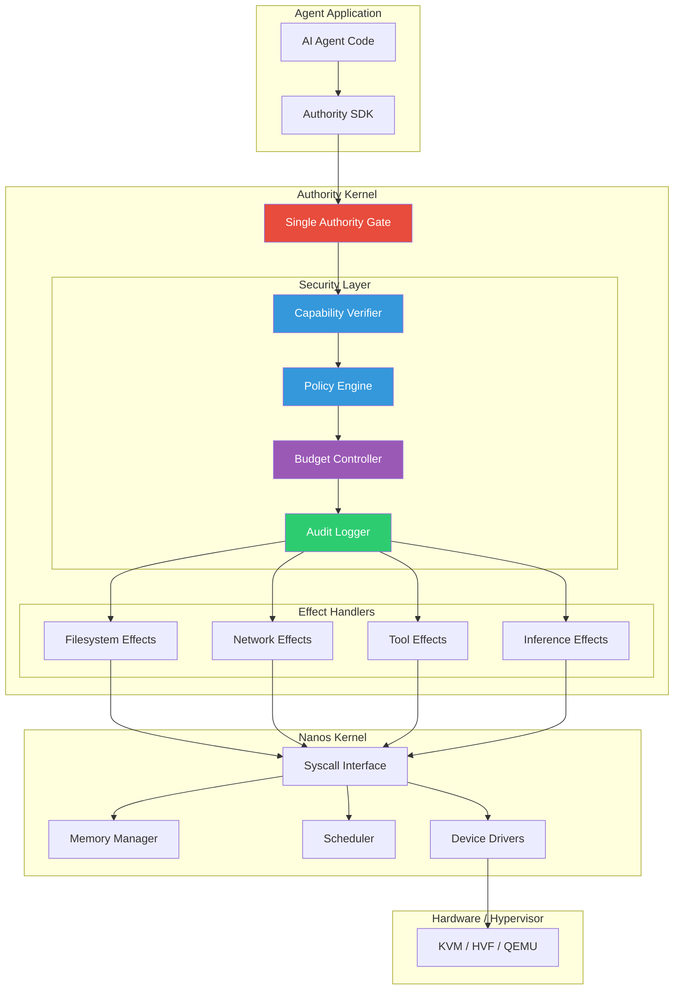
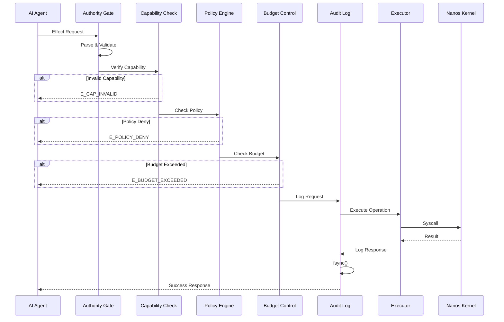
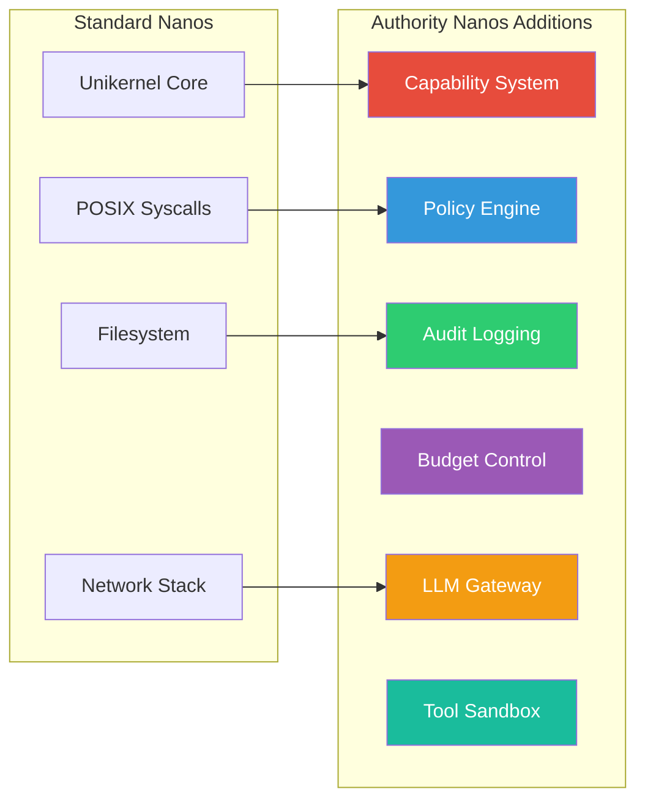
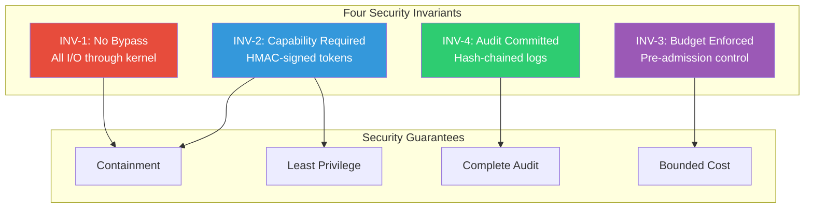
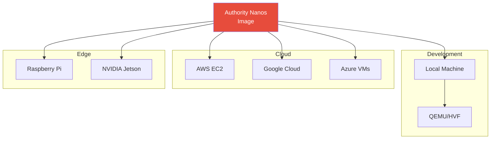

## System Architecture



## Request Flow

Every operation in Authority Nanos follows this security pipeline:



## What is Authority Nanos?

Authority Nanos is a **fork of [Nanos](https://github.com/mbhatt1/nanos)** that adds the **Authority Kernel** — a capability-based security layer purpose-built for running autonomous AI agents in production.



## Security Model



## Quick Example

Create a policy file (`/ak/policy.json`):

```json
{
  "version": "1.0",
  "fs": {
    "read": ["/app/**", "/lib/**"],
    "write": ["/tmp/**"]
  },
  "net": {
    "dns": ["api.example.com"],
    "connect": ["dns:api.example.com:443"]
  },
  "profiles": ["tier1-musl"]
}
```

Build and run:

```bash
authority build myapp -c config.json
authority run myapp
```

## Deployment Options



## Project Status

| Component | Status |
|-----------|--------|
| Core Kernel | Stable |
| Authority Kernel | Stable |
| Security Invariants (INV-1 to INV-4) | Enforced |
| Documentation | Active |

See the [roadmap](/architecture/#roadmap) for upcoming features.
