# Policy Overview

The Authority Kernel uses a **deny-by-default** policy model:

- If no policy is loaded, ALL operations are denied
- If a policy is loaded, only explicitly allowed operations succeed
- Missing rules for a category = deny that category

## Policy Evaluation Flow


## Policy Structure


## Policy Formats

Authority Nanos supports two policy formats:

- [JSON Format](/policy/json-format) - Primary format for P0
- [TOML Format](/policy/toml-format) - Human-friendly alternative (P1)

## Policy Location

```mermaid
graph LR
    subgraph "Development"
        INITRD[/ak/policy.json<br/>in initrd]
    end

    subgraph "Production"
        EMBED[Embedded in kernel<br/>at compile time]
    end

    subgraph "Runtime"
        LOADER[Policy Loader]
        CACHE[Cached Policy]
    end

    INITRD --> LOADER
    EMBED --> LOADER
    LOADER --> CACHE

    style INITRD fill:#3498db,color:#fff
    style EMBED fill:#e74c3c,color:#fff
    style CACHE fill:#2ecc71,color:#fff
```

### Development (Initrd)

Place your policy at `/ak/policy.json` in the initrd:

```bash
mkdir -p initrd/ak
cp policy.json initrd/ak/policy.json
```

### Production (Embedded)

Compile policy into the kernel image:

```makefile
CFLAGS += -DCONFIG_AK_EMBEDDED_POLICY=1
```

## Pattern Matching

```mermaid
graph TB
    subgraph "Filesystem Pattern Matching"
        PATH[/app/data/file.txt]

        P1["/app/**"] -->|MATCH| PATH
        P2["/app/data/*"] -->|MATCH| PATH
        P3["/app/data/file.txt"] -->|MATCH| PATH
        P4["/tmp/**"] -->|NO MATCH| PATH
    end

    subgraph "Network Pattern Matching"
        TARGET[dns:api.github.com:443]

        N1["dns:api.github.com:443"] -->|MATCH| TARGET
        N2["dns:*.github.com:443"] -->|MATCH| TARGET
        N3["dns:*:443"] -->|MATCH| TARGET
        N4["ip:*:443"] -->|NO MATCH| TARGET
    end

    style PATH fill:#3498db,color:#fff
    style TARGET fill:#9b59b6,color:#fff
```

## Quick Reference

### Filesystem Rules

```json
{
  "fs": {
    "read": ["/app/**", "/lib/**"],
    "write": ["/tmp/**"]
  }
}
```

### Network Rules

```json
{
  "net": {
    "dns": ["api.github.com", "*.googleapis.com"],
    "connect": ["dns:api.github.com:443", "ip:10.0.0.0/8:5432"],
    "bind": ["ip:0.0.0.0:8080"],
    "listen": ["ip:0.0.0.0:8080"]
  }
}
```

### Tool Rules

```json
{
  "tools": {
    "allow": ["http_get", "file_read"],
    "deny": ["shell_exec"]
  }
}
```

### Inference Rules

```json
{
  "infer": {
    "models": ["gpt-4", "claude-*"],
    "max_tokens": 100000
  }
}
```

### Budgets

```json
{
  "budgets": {
    "tool_calls": 100,
    "tokens": 100000,
    "wall_time_ms": 300000
  }
}
```

## Budget Enforcement

```mermaid
sequenceDiagram
    participant Agent
    participant Gate as Authority Gate
    participant Budget as Budget Controller
    participant Op as Operation

    Agent->>Gate: Request (cost=10 tokens)
    Gate->>Budget: Check budget

    Budget->>Budget: current=90, limit=100
    Budget->>Budget: 90 + 10 <= 100?

    alt Within Budget
        Budget-->>Gate: OK
        Gate->>Op: Execute
        Op-->>Gate: Success
        Gate->>Budget: Commit cost
        Budget->>Budget: current = 100
        Gate-->>Agent: Success
    else Exceeds Budget
        Budget-->>Gate: E_BUDGET_EXCEEDED
        Gate-->>Agent: Error (budget exceeded)
    end
```



## Profile Inheritance


## Denial Debugging


### Console Messages

When an operation is denied:

```
AK DENY FS_OPEN /etc/secret missing fs.read. Fix: read = ["/etc/secret"]
```

### Last Error Syscall

```c
char buf[1024];
syscall(AK_SYS_LAST_ERROR, buf, sizeof(buf));
// buf contains JSON with denial details
```

### Record Mode

Run with `AK_RECORD=1` to accumulate suggestions:

```bash
AK_RECORD=1 ./myapp
```

## Validation

P0 validates:
- Version field present and correct
- All patterns are valid strings
- All numbers are valid integers
- No unknown fields (warning)

### Common Errors

| Error | Cause | Fix |
|-------|-------|-----|
| "Missing version" | No version field | Add `"version": "1.0"` |
| "Invalid JSON" | Syntax error | Check JSON syntax |
| "Pattern too long" | Pattern > 256 chars | Shorten pattern |
| "Invalid CIDR" | Bad CIDR format | Check format |
