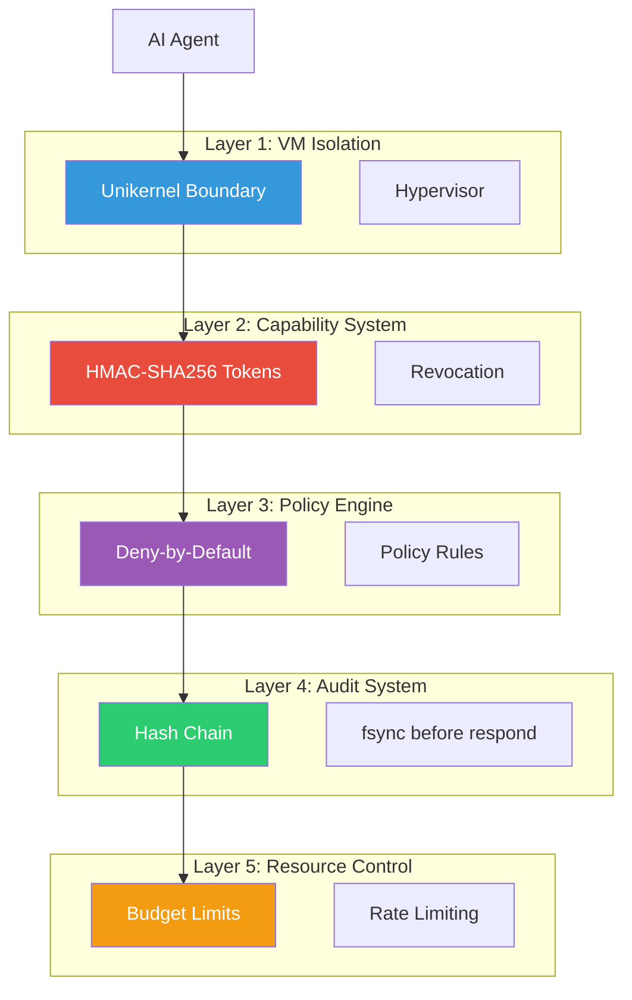
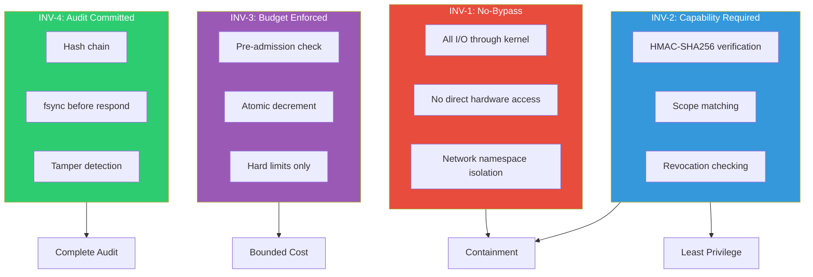
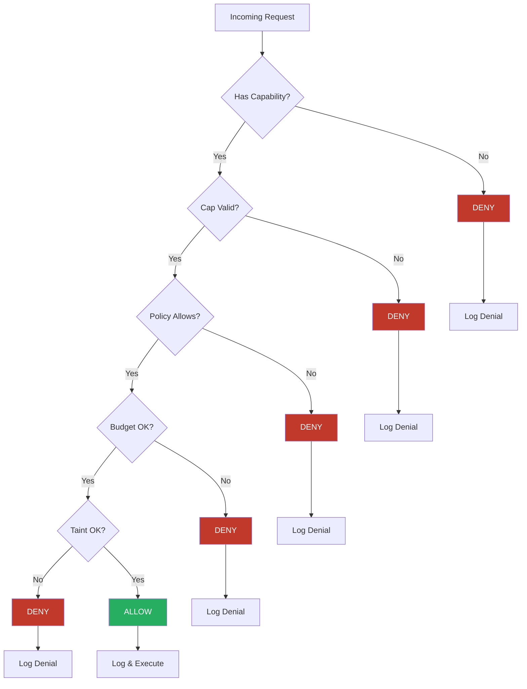
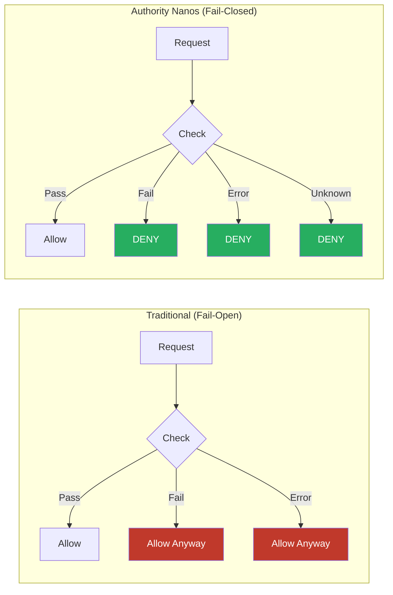
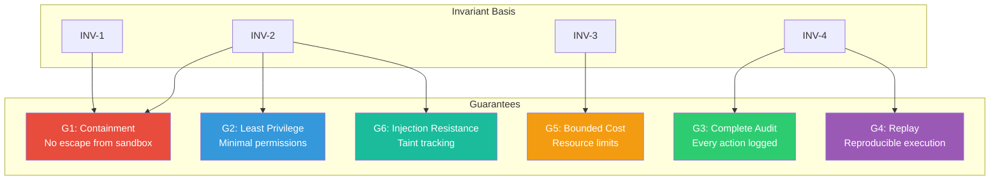
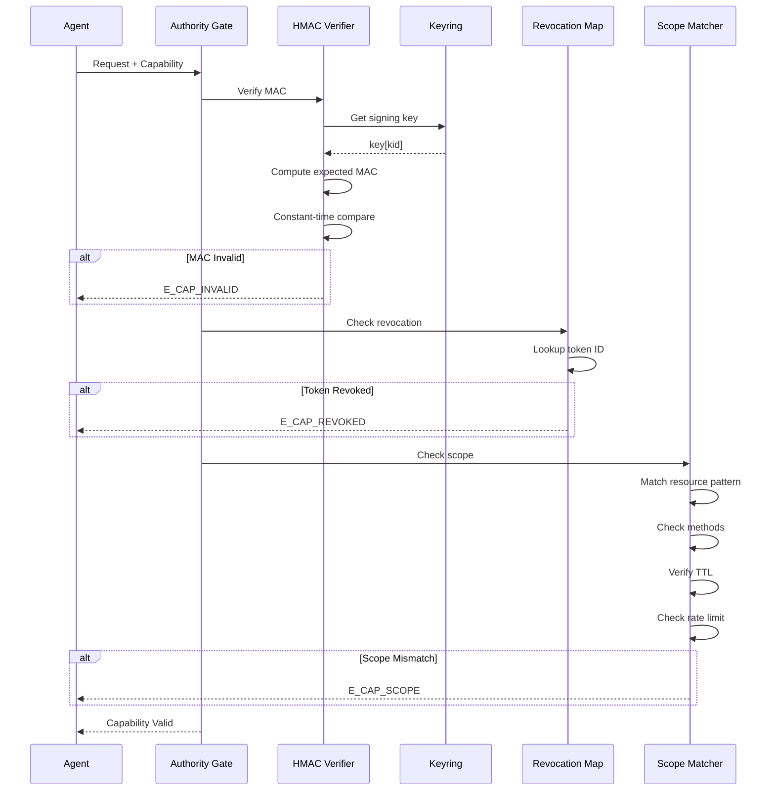
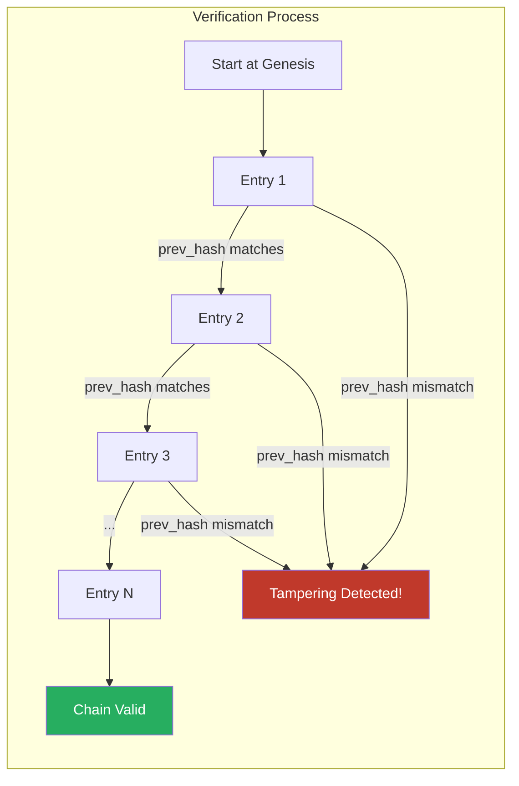

# Security Overview

Authority Nanos provides security-first design for AI agent runtimes. This section covers:

- [Security Invariants](/security/invariants) - The four foundational guarantees
- [Threat Model](/security/threat-model) - What we protect against

## Defense in Depth



## The Four Invariants



## Security Philosophy

### Zero-Trust Model



### Fail-Closed Principle



## Six Security Guarantees



## Capability Verification Flow



## Audit Chain Verification



## Incident Response Flow

```mermaid
stateDiagram-v2
    [*] --> Detected: Invariant Violation

    Detected --> Halt: IMMEDIATE
    Halt --> Revoke: Halt all agents
    Revoke --> Investigate: Revoke capabilities

    Investigate --> Forensics: Audit log analysis
    Forensics --> RootCause: Identify cause

    RootCause --> Patch: Develop fix
    Patch --> Proof: Prove invariant preserved

    Proof --> Test: Full test suite
    Test --> Deploy: All tests pass

    Deploy --> [*]: Resume operations

    note right of Halt: P0: < 1 hour
    note right of Investigate: Preserve evidence
    note right of Proof: Mathematical proof required
```

## Security Testing Matrix

```mermaid
graph TB
    subgraph "INV-1 Tests"
        T1_1[Direct socket attempt]
        T1_2[execve blocked]
        T1_3[Network namespace escape]
    end

    subgraph "INV-2 Tests"
        T2_1[Random HMAC forgery]
        T2_2[Expired capability]
        T2_3[Scope violation]
        T2_4[Revoked token use]
    end

    subgraph "INV-3 Tests"
        T3_1[Budget exhaustion]
        T3_2[Concurrent budget race]
        T3_3[Negative budget]
    end

    subgraph "INV-4 Tests"
        T4_1[Log bit flip]
        T4_2[Entry deletion]
        T4_3[Response before fsync]
    end

    T1_1 --> PASS1[Must FAIL]
    T1_2 --> PASS2[Must FAIL]
    T1_3 --> PASS3[Must FAIL]
    T2_1 --> PASS4[Must REJECT]
    T2_2 --> PASS5[Must REJECT]
    T2_3 --> PASS6[Must REJECT]
    T2_4 --> PASS7[Must REJECT]
    T3_1 --> PASS8[Must BLOCK]
    T3_2 --> PASS9[Must BLOCK]
    T3_3 --> PASS10[Must BLOCK]
    T4_1 --> PASS11[Must DETECT]
    T4_2 --> PASS12[Must DETECT]
    T4_3 --> PASS13[Must NEVER happen]

    style PASS1 fill:#27ae60,color:#fff
    style PASS4 fill:#27ae60,color:#fff
    style PASS8 fill:#27ae60,color:#fff
    style PASS11 fill:#27ae60,color:#fff
```



## Zero-Tolerance Policies

| Policy | Description |
|--------|-------------|
| No Security TODOs | Code with TODO on security paths MUST NOT be merged |
| No Soft Failures | Security checks MUST hard-fail |
| No Ambient Authority | Every privileged operation requires capability |
| No Exception Paths | Security validation on ALL code paths |
| Fail Closed | On ANY ambiguity, DENY |
