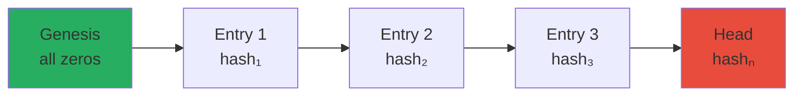

# Security Invariants

::: tip Formal Guarantees
These four invariants MUST hold at ALL times. They are not guidelines—they are mathematical properties that the implementation MUST preserve.
:::

Authority Nanos enforces four foundational security invariants that provide mathematical guarantees about agent behavior. Any violation is a **P0 security incident**.

## I. The Four Invariants

### INV-1: No-Bypass Invariant

> **Statement**: Agents cannot perform external IO except via kernel IPC.

#### Formal Definition

```
∀ agent A, ∀ IO operation O:
    O is external ⟹ O goes through kernel IPC channel
```

#### Enforcement Mechanisms

| Layer | Mechanism | Blocks |
|-------|-----------|--------|
| **Syscall** | Seccomp-BPF filter | `socket(AF_INET*)`, `execve`, `fork`, `ptrace` |
| **Network** | Namespace isolation | All except loopback |
| **Filesystem** | Mount namespace | Write access outside scratch |
| **Process** | FD inheritance blocking | Pre-existing connections |

#### Verification

::: danger Required
Confinement escape tests MUST pass before any agent execution.
:::

```bash
# Test confinement
authority test confinement
```

---

### INV-2: Capability Invariant

> **Statement**: Every effectful syscall must carry a valid, non-revoked capability whose scope subsumes the request.

#### Formal Definition

```
∀ syscall S where effect(S) = true:
    ∃ capability C in request R such that:
        valid(C) ∧ ¬revoked(C) ∧ scope(C) ⊇ resource(S)
```

#### Validation Requirements

**valid(C)**: HMAC-SHA256 verification passes

```c
bool verify_capability(capability_t *cap) {
    // 1. Check HMAC signature
    uint8_t expected_mac[32];
    compute_hmac_sha256(cap->data, cap->len, secret_key, expected_mac);
    if (memcmp(cap->mac, expected_mac, 32) != 0) return false;
    
    // 2. Check not revoked
    if (is_revoked(cap->token_id)) return false;
    
    // 3. Check scope matches request
    return scope_subsumes(cap, request);
}
```

**¬revoked(C)**: Token ID not in revocation map

**scope(C) ⊇ resource(S)**:
- Capability type matches operation type
- Resource pattern matches target resource  
- Methods include requested method
- TTL not expired
- Rate limit not exceeded

::: warning Strict Enforcement
Capability verification is called BEFORE any syscall dispatch. Ambiguous cases are denied.
:::

---

### INV-3: Budget Invariant

> **Statement**: Admission control rejects any operation that would exceed declared run budgets.

#### Formal Definition

```
∀ operation O with cost(O) = c:
    let current = Σ(costs of completed operations in run)
    let budget = declared_budget(run_id, resource_type)

    PRE: current + c ≤ budget
    POST: current' = current + c

    If PRE fails: reject with E_BUDGET_EXCEEDED (no state change)
```

#### Budget Dimensions

| Resource | Unit | Default Limit | Enforcement |
|----------|------|---------------|-------------|
| **LLM Input Tokens** | tokens | 1,000,000 | Pre-call check |
| **LLM Output Tokens** | tokens | 100,000 | Post-call decrement |
| **Tool Calls** | count | 100 | Atomic counter |
| **Wall Time** | ms | 300,000 | Deadline timer |
| **Heap Objects** | count | 10,000 | Allocator hook |
| **Blob Storage** | bytes | 100 MB | Quota system |

#### Implementation

```c
int check_budget(run_t *run, resource_type_t type, uint64_t cost) {
    uint64_t current = atomic_load(&run->budget[type].used);
    uint64_t limit = run->budget[type].limit;
    
    // Atomic test-and-set
    uint64_t new_value = current + cost;
    if (new_value > limit) {
        return E_BUDGET_EXCEEDED;
    }
    
    if (!atomic_compare_exchange(&run->budget[type].used, &current, new_value)) {
        // Race detected, retry
        return check_budget(run, type, cost);
    }
    
    return 0;
}
```

::: tip No Soft Limits
Budget checks are hard enforcement only. No warnings, no grace periods—operations are rejected at the limit.
:::

---

### INV-4: Log Commitment Invariant

> **Statement**: Each committed transition appends a log entry whose hash chain validates from genesis to head.

#### Formal Definition

```
∀ state transition T from Σ to Σ':
    ∃ log entry E such that:
        E.prev_hash = hash(log[n-1])
        E.this_hash = SHA256(E.prev_hash || canonical(E))
        E.req_hash = SHA256(canonical(request))
        E.res_hash = SHA256(canonical(response))

        AND: log' = log ++ [E]
        AND: Response sent to agent only AFTER fsync(log)
```

#### Hash Chain Properties



**Properties**:
- **Append-only**: No deletions, no modifications
- **Tamper-evident**: Any modification breaks the chain
- **Non-repudiation**: Agent cannot deny actions (req_hash proves request)

#### Verification Algorithm

```python
def verify_chain(log):
    """Verify hash chain from genesis to head"""
    expected_hash = GENESIS_HASH  # All zeros
    
    for entry in log:
        # Check prev_hash matches expected
        if entry.prev_hash != expected_hash:
            return False, f"Chain break at entry {entry.seq}"
        
        # Recompute this_hash
        canonical = canonicalize(entry)
        computed = sha256(entry.prev_hash + canonical)
        
        if entry.this_hash != computed:
            return False, f"Hash mismatch at entry {entry.seq}"
        
        expected_hash = entry.this_hash
    
    return True, "Chain valid"
```

::: danger Synchronous Logging
Log writes occur in the same transaction as state mutations. The agent receives a response ONLY AFTER `fsync()` completes.
:::

---

## II. Security Theorems

### Theorem 1: Containment

> Under adversary classes I-III, no side effects occur except through validated syscalls.

**Adversary Classes**:
- **Class I**: Arbitrary malicious inputs (prompt injection)
- **Class II**: Compromised agent logic (model poisoning)
- **Class III**: Tool runtime escape attempts

**Proof Sketch**:

```
Given: INV-1 (no bypass) + INV-2 (capability required)
Assume: Side effect E occurs outside kernel validation

Case 1: E via direct IO
    → Blocked by confinement (INV-1) ⊥

Case 2: E via syscall without capability
    → Rejected by capability check (INV-2) ⊥

Case 3: E via forged capability
    → HMAC verification fails (INV-2) ⊥

∴ No such E exists. QED.
```

---

### Theorem 2: Audit Completeness

> Every state-changing operation produces a corresponding log entry whose hash commits to all prior entries.

**Proof Sketch**:

```
Given: INV-4 (log commitment)

For any state Σ at time t:
    Let L = [E₀, E₁, ..., Eₙ] be the log

    ∀ i ∈ [1,n]: Eᵢ.prev_hash = hash(Eᵢ₋₁)

    To reconstruct Σ:
        Start from genesis state Σ₀
        Apply each Eᵢ sequentially
        Verify hash chain at each step

    Any tampering at position k:
        Eₖ'.this_hash ≠ Eₖ₊₁.prev_hash
        → Chain breaks → Detected

∴ Audit trail is complete and tamper-evident. QED.
```

---

### Theorem 3: Budget Enforcement

> Resource consumption is bounded by declared budgets; exceeding operations rejected pre-execution.

**Proof Sketch**:

```
Given: INV-3 (budget invariant)

∀ run R with budget B:
    Let Cᵢ = cost of operation i
    Let Sₙ = Σᵢ₌₁ⁿ Cᵢ (total cost after n operations)

    By INV-3: ∀ n: Sₙ + Cₙ₊₁ > B ⟹ operation n+1 rejected

    ∴ Sₙ ≤ B for all n
    ∴ Total resource consumption ≤ B. QED.
```

---

## III. The Six Guarantees

| # | Guarantee | Invariant Basis | Enforcement |
|---|-----------|-----------------|-------------|
| **G1** | Containment | INV-1, INV-2 | Confinement + Capabilities |
| **G2** | Least Privilege | INV-2 | Capability scope checking |
| **G3** | Audit | INV-4 | Hash-chained log |
| **G4** | Replay | INV-4 | Deterministic from log |
| **G5** | Bounded Cost | INV-3 | Pre-execution admission |
| **G6** | Injection Resistance | INV-2 + Taint | Capability + taint validation |

---

## IV. Verification Matrix

| Invariant | Test Category | Pass Criteria | Test Command |
|-----------|---------------|---------------|--------------|
| **INV-1** | Confinement | 0 escape paths | `authority test confinement` |
| **INV-2** | Capability | 0 forgeries, 0 bypasses | `authority test capabilities` |
| **INV-3** | Budget | 0 overruns | `authority test budgets` |
| **INV-4** | Audit | 0 undetected tampering | `authority test audit` |

::: tip Continuous Verification
- Every commit runs invariant tests
- Every PR requires security review
- Every release requires penetration test
:::

---

## V. Zero-Tolerance Policies

### Policy 1: No Security TODOs

**Rule**: Code containing `TODO` comments on security-critical paths MUST NOT be merged.

**Rationale**: TODOs become permanent. Security gaps are exploitable.

### Policy 2: No Soft Failures

**Rule**: Security checks MUST hard-fail. No "log and continue" on security violations.

**Rationale**: Soft failures allow bypass. Attackers find edge cases.

### Policy 3: No Ambient Authority

**Rule**: Every privileged operation MUST require explicit capability.

**Rationale**: Ambient authority (implicit permissions) enables confused deputy attacks.

### Policy 4: No Exception Paths

**Rule**: Security validation MUST occur on ALL code paths, including error handlers.

**Rationale**: Exception handlers are often less tested and more vulnerable.

### Policy 5: Fail Closed

**Rule**: On any ambiguity or error in security validation, DENY.

**Rationale**: Fail-open creates exploitable windows. Unknown = untrusted.

---

## VI. Incident Response

### If Invariant Violation Detected

1. **IMMEDIATE**: Halt all agent execution
2. **CONTAIN**: Revoke all active capabilities
3. **INVESTIGATE**: Audit log forensics
4. **REMEDIATE**: Patch with invariant proof
5. **VERIFY**: Full test suite before restart

### Severity Classification

| Severity | Definition | Response Time |
|----------|------------|---------------|
| **P0** | Invariant violation in production | < 1 hour |
| **P1** | Invariant violation in staging | < 4 hours |
| **P2** | Test failure on invariant | < 24 hours |
| **P3** | Potential invariant weakness | < 1 week |

---

::: danger Security Contact
For security vulnerabilities, contact: security@nanovms.com (private disclosure)
:::

*This document is normative. All Authority Kernel implementations MUST comply.*
