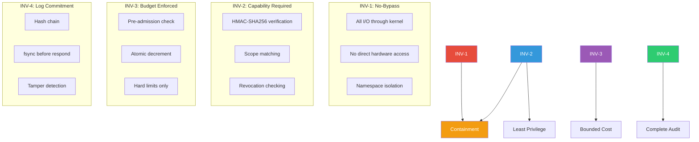
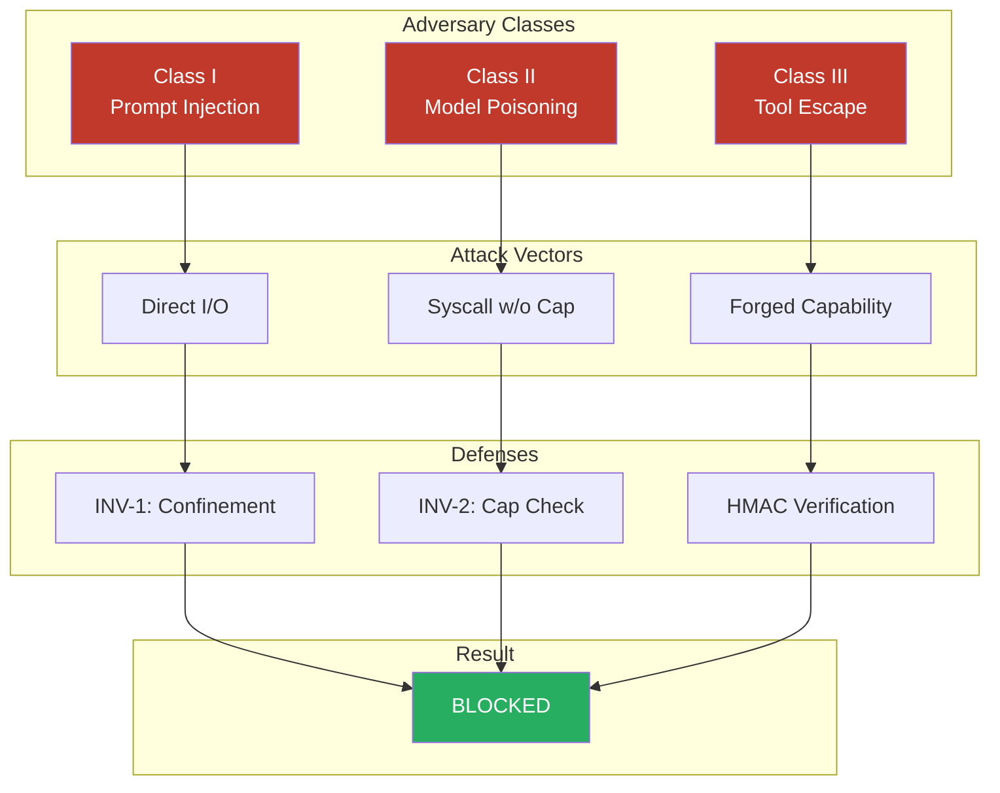

# Security Invariants

Authority Nanos enforces four foundational security invariants. These are not guidelines — they are properties that the implementation **MUST** preserve at all times.

Any invariant violation is a **P0 security incident**.

## Invariant Overview



## INV-1: No-Bypass Invariant

> **Statement**: Agents cannot perform external IO except via kernel IPC.

### Preconditions

- Agent process is confined (namespaces + seccomp on Linux; ES framework on macOS)
- Network namespace contains only loopback
- Filesystem is read-only except designated scratch
- Only allowed syscalls are in whitelist

### Formal Definition

```
∀ agent A, ∀ IO operation O:
    O is external ⟹ O goes through kernel IPC channel
```

### Enforcement Points

1. Seccomp-BPF filter blocks: `socket(AF_INET*)`, `execve`, `fork`, `ptrace`
2. Network namespace isolation
3. Mount namespace with pivot_root to isolated root
4. File descriptor inheritance blocked

### Verification

Confinement escape tests MUST pass before any agent execution.

## INV-2: Capability Invariant

> **Statement**: Every effectful syscall must carry a valid, non-revoked capability whose scope subsumes the request.

### Formal Definition

```
∀ syscall S where effect(S) = true:
    ∃ capability C in request R such that:
        valid(C) ∧ ¬revoked(C) ∧ scope(C) ⊇ resource(S)
```

### Implementation Requirements

- **valid(C)**: HMAC-SHA256 verification passes
- **¬revoked(C)**: Token ID not in revocation map R
- **scope(C) ⊇ resource(S)**:
  - C.type matches operation type
  - C.resource pattern matches target resource
  - C.methods includes requested method
  - C.ttl not expired
  - C.rate not exceeded

### Enforcement Points

1. `capability_verify()` called BEFORE any syscall dispatch
2. Revocation map checked synchronously (not eventual consistency)
3. Scope matching is strict (deny if ambiguous)

### Verification

Capability forgery tests MUST fail to forge valid tokens.

## INV-3: Budget Invariant

> **Statement**: Admission control rejects any operation that would exceed declared run budgets.

### Formal Definition

```
∀ operation O with cost(O) = c:
    let current = Σ(costs of completed operations in run)
    let budget = declared_budget(run_id, resource_type)

    PRE: current + c ≤ budget
    POST: current' = current + c

    If PRE fails: reject with E_BUDGET_EXCEEDED (no state change)
```

### Budget Dimensions

| Resource | Unit | Default Limit |
|----------|------|---------------|
| LLM Input Tokens | tokens | 1,000,000 |
| LLM Output Tokens | tokens | 100,000 |
| Tool Calls | count | 100 |
| Wall Time | ms | 300,000 |
| Heap Objects | count | 10,000 |
| Blob Storage | bytes | 100 MB |

### Enforcement Points

1. Budget check BEFORE operation starts
2. Atomic decrement-or-reject (no race conditions)
3. No "soft limits" — hard enforcement only

### Verification

Budget exhaustion tests MUST block at limit.

## INV-4: Log Commitment Invariant

> **Statement**: Each committed transition appends a log entry whose hash chain validates from genesis to head.

### Formal Definition

```
∀ state transition T from Σ to Σ':
    ∃ log entry E such that:
        E.prev_hash = hash(log[n-1])
        E.this_hash = SHA256(E.prev_hash || canonical(E))
        E.req_hash = SHA256(canonical(request))
        E.res_hash = SHA256(canonical(response))

        AND: log' = log ++ [E]
        AND: Response sent to agent only AFTER fsync(log)
```

### Hash Chain Properties

- **Append-only**: No deletions, no modifications
- **Tamper-evident**: Any modification breaks chain
- **Non-repudiation**: Agent cannot deny actions (req_hash proves request)

### Enforcement Points

1. Log write in same transaction as state mutation
2. `fsync()` before response
3. Crash recovery validates chain from genesis

### Verification

Log tamper tests MUST detect any bit flip.

## Security Theorems



### Theorem 1: Containment

> Under adversary classes I-III, no side effects occur except through validated syscalls.

**Adversary Classes**:
- Class I: Arbitrary malicious inputs (prompt injection)
- Class II: Compromised agent logic (model poisoning)
- Class III: Tool runtime escape attempts

**Proof Sketch**:
```
Given: INV-1 (no bypass) + INV-2 (capability required)
Assume: Side effect E occurs outside kernel validation

Case 1: E via direct IO
    → Blocked by confinement (INV-1) ⊥

Case 2: E via syscall without capability
    → Rejected by capability check (INV-2) ⊥

Case 3: E via forged capability
    → HMAC verification fails (INV-2) ⊥

∴ No such E exists. QED.
```

### Theorem 2: Audit Completeness

> Every state-changing operation produces a corresponding log entry whose hash commits to all prior entries.

**Proof Sketch**:
```
Given: INV-4 (log commitment)

For any state Σ at time t:
    Let L = [E₀, E₁, ..., Eₙ] be the log

    ∀ i ∈ [1,n]: Eᵢ.prev_hash = hash(Eᵢ₋₁)

    To reconstruct Σ:
        Start from genesis state Σ₀
        Apply each Eᵢ sequentially
        Verify hash chain at each step

    Any tampering at position k:
        Eₖ'.this_hash ≠ Eₖ₊₁.prev_hash
        → Chain breaks → Detected

∴ Audit trail is complete and tamper-evident. QED.
```

### Theorem 3: Budget Enforcement

> Resource consumption is bounded by declared budgets; exceeding operations rejected pre-execution.

**Proof Sketch**:
```
Given: INV-3 (budget invariant)

∀ run R with budget B:
    Let Cᵢ = cost of operation i
    Let Sₙ = Σᵢ₌₁ⁿ Cᵢ (total cost after n operations)

    By INV-3: ∀ n: Sₙ + Cₙ₊₁ > B ⟹ operation n+1 rejected

    ∴ Sₙ ≤ B for all n
    ∴ Total resource consumption ≤ B. QED.
```

## Verification Matrix

| Invariant | Test Category | Pass Criteria |
|-----------|---------------|---------------|
| INV-1 | Confinement | 0 escape paths |
| INV-2 | Capability | 0 forgeries, 0 bypasses |
| INV-3 | Budget | 0 overruns |
| INV-4 | Audit | 0 undetected tampering |

**Continuous Verification**:
- Every commit runs invariant tests
- Every PR requires security review
- Every release requires penetration test
