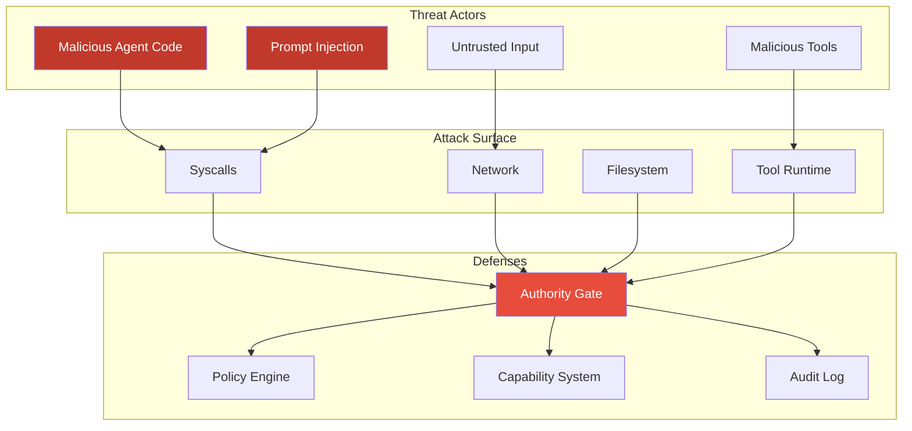
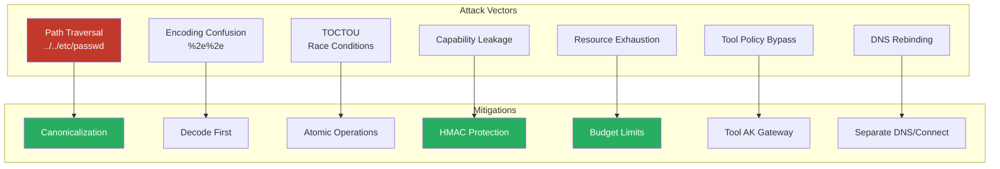
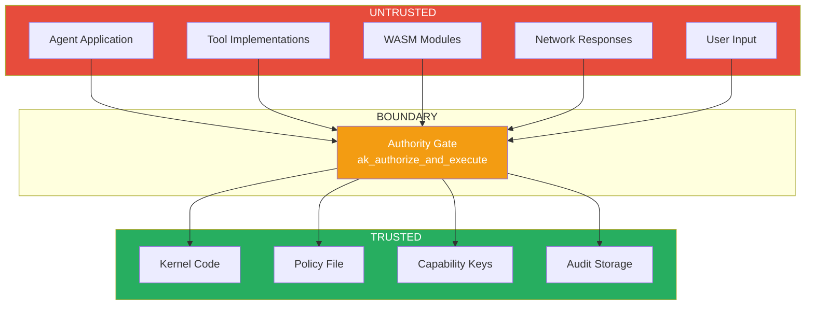

# Threat Model

This document defines the threat model for the Authority Kernel deny-by-default security system.

## Threat Model Overview

## Attacker Model

### Threat Actors

**Primary: Malicious/Compromised Agent Code**
- AI agent code that attempts to exceed its authorized capabilities
- Agents that have been prompt-injected or otherwise compromised
- Tools or WASM modules with malicious intent

**Secondary: Malicious External Input**
- Untrusted data from external APIs
- User input designed to trigger unintended behavior
- Network responses containing malicious payloads

### Attacker Capabilities

We assume the attacker can:
- Execute arbitrary code within the agent sandbox
- Make arbitrary syscalls (which will be mediated by AK)
- Craft malicious tool inputs/outputs
- Attempt to confuse policy matching through encoding tricks
- Attempt time-of-check to time-of-use (TOCTOU) attacks

### Attacker Limitations

We assume the attacker CANNOT:
- Execute code in kernel space
- Modify kernel memory directly
- Bypass CPU protection mechanisms (rings, MMU)
- Access hardware directly (all I/O is virtualized)
- Modify the policy after it's loaded

## Security Goals

### Non-Bypass (INV-1)

**Goal:** No effectful operation can bypass Authority Kernel mediation.

**Mechanism:**
- All syscalls route through `ak_authorize_and_execute()`
- POSIX syscalls are translated to AK effects
- No direct hardware access from userspace
- WASM hostcalls are capability-gated

**Verification:**
- Static analysis: No effectful paths that skip mediation
- Runtime: Mode=HARD denies raw effectful syscalls

### Deny-by-Default (INV-DENY)

**Goal:** Any operation not explicitly allowed by policy is denied.

**Mechanism:**
- Policy matching returns DENY if no rule matches
- Missing policy = fail closed
- Empty policy sections = deny that category

**Verification:**
- Test: Empty policy denies all effects
- Test: Missing policy prevents boot or denies all

### Capability Integrity (INV-2)

**Goal:** Capabilities cannot be forged or escalated.

**Mechanism:**
- Capabilities are HMAC-protected
- Kernel controls capability issuance
- Delegation can only attenuate, never escalate
- Revocation is immediate and audited

**Verification:**
- Test: Modified capability rejected
- Test: Delegation cannot exceed parent scope

### Budget Enforcement (INV-3)

**Goal:** Resource consumption is bounded and tracked.

**Mechanism:**
- Per-run budget limits (tokens, calls, time, bytes)
- Pre-admission budget check
- Exceeded budget = operation denied

**Verification:**
- Test: Exceeded token budget denies inference
- Test: Exceeded call budget denies tool calls

### Audit Integrity (INV-4)

**Goal:** All effectful operations are logged and logs are tamper-evident.

**Mechanism:**
- Hash-chained audit entries
- Synchronous logging for control-plane
- Bounded ring buffer for data-plane
- Audit append before response

**Verification:**
- Test: Audit chain verification detects tampering
- Test: Control-plane ops appear in audit before response

## Attack Vectors and Mitigations

### Path Traversal

**Attack:** Use `..` or symbolic links to access files outside allowed paths.

**Mitigation:**
- Canonicalization before policy matching
- Normalize `.` and `..` segments
- Lexical canonicalization (symlinks not resolved in P0)

**Residual Risk:** Symlink-based attacks (mitigated by not resolving symlinks)

### Encoding Confusion

**Attack:** Use different encodings to confuse policy matching (e.g., %2e%2e for ..)

**Mitigation:**
- Decode before canonicalization
- Single canonical form for all targets
- Bounded buffers prevent overflow

### TOCTOU (Time-of-Check to Time-of-Use)

**Attack:** Change target between policy check and actual operation.

**Mitigation:**
- Canonicalize immediately on syscall entry
- Use canonical target for both check and operation
- No user-controlled strings in policy matching

### Capability Leakage

**Attack:** Extract or forge capability tokens.

**Mitigation:**
- Capabilities are HMAC-protected
- Keys are kernel-internal only
- Capabilities are bound to run_id
- Rate limiting prevents brute force

### Resource Exhaustion

**Attack:** Exhaust system resources to cause denial of service.

**Mitigation:**
- Budget limits on all resource types
- Bounded buffers throughout
- Rate limiting on deny logging
- Ring buffer for data-plane audit

### Policy Bypass via Tools

**Attack:** Use tools or WASM to perform operations that bypass AK.

**Mitigation:**
- Tools cannot access FS/NET directly
- Tool FS/NET operations route through AK
- WASM hostcalls are capability-gated
- No ambient authority in tool runtime

### DNS Rebinding

**Attack:** DNS response changes between resolve and connect.

**Mitigation:**
- Separate `net.dns` and `net.connect` capabilities
- DNS resolution is an effect requiring authorization
- Policy can require IP-based connect authorization

### Audit Log Overflow

**Attack:** Generate many events to overflow audit log.

**Mitigation:**
- Bounded ring buffer for data-plane
- Rate limiting on deny messages
- Control-plane events counted toward budget

## Trust Boundaries

### Trusted Components

- Kernel code (including AK)
- Policy file (validated at load time)
- Capability keys (kernel-internal)
- Audit log storage

### Untrusted Components

- Agent application code
- Tool implementations
- WASM modules
- External network responses
- User input

### Boundary Enforcement

Every crossing from untrusted to trusted requires:
1. Effect creation with canonical target
2. Policy authorization via `ak_authorize_and_execute()`
3. Audit logging
4. Bounded, validated parameters

## Assumptions

### Hardware/Hypervisor

- CPU protection mechanisms work correctly
- MMU enforces memory protection
- Hypervisor (if any) is trusted

### Kernel

- Kernel code is not compromised
- Kernel memory is protected from userspace

### Policy

- Policy is created by trusted administrator
- Policy is not modified after load
- Policy signature (if present) is verified

### Cryptography

- SHA-256 is collision-resistant
- HMAC-SHA256 is unforgeable
- Ed25519 signatures are secure

## Out of Scope

The following are explicitly NOT protected against:

### Side Channels

- Timing attacks on policy matching
- Cache-based side channels
- Speculative execution attacks

### Physical Attacks

- Physical access to hardware
- Cold boot attacks
- Hardware implants

### Denial of Service

- Legitimate resource exhaustion within budget
- Network-level DoS (external to kernel)

### Policy Errors

- Overly permissive policy configuration
- Missing rules that should be present
- Incorrect pattern specifications

### Kernel Vulnerabilities

- Bugs in kernel code itself
- Memory corruption in trusted code

## Security Invariant Summary

| ID | Invariant | Description |
|----|-----------|-------------|
| INV-1 | No-Bypass | All effects through mediation |
| INV-2 | Capability | Every effectful op needs valid cap |
| INV-3 | Budget | Resource limits enforced |
| INV-4 | Log Commitment | All ops audited before response |
| INV-DENY | Deny-by-Default | No implicit permissions |
| INV-SINGLE | Single Gate | One authorization function |
| INV-CANONICAL | Canonicalization | Targets normalized before match |
| INV-BOUNDED | Bounded Buffers | All buffers have max sizes |
